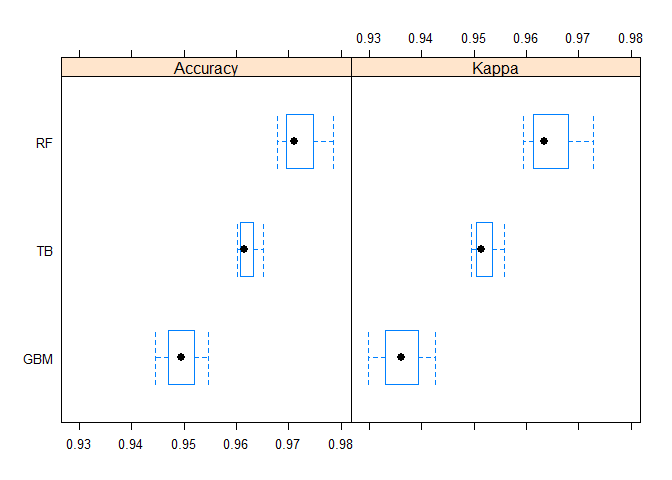

# Machine Learning Exercise
Bill Eddins  
`r Sys.Date()`  

#Overview

The purpose of this report is to get credit for an online course in machine learning and to predict the type of barbell activity being performed. See the following link for more information on this certification. Look for the course titled 'Practical Machine Learning'.

[Data Science Specialization](https://www.coursera.org/specialization/jhudatascience/1?utm_source=catalog)

The data come from a reseach study of subjects conducting physical activites using a barbell while being monitored by wearable devices, i.e. the Microsoft Kinect. Each record in the dataset represents a subject doing a barbbell curl. There are five classes or types of curl exercise. One was the correct class, the other four are themes on incorrect techniques. See the following link.  

[Human Activity Recognition](http://groupware.les.inf.puc-rio.br/har)

##A machine learning algorithm predicting activity quality

All R code for this report can be found in the appendix. The outcome of the study is to build a model that predicts barbell activies using a testing file and a training file. The response variable is 'classe' which designates a row as being one of the five classes of barbell activities. In order to reduce out of sample errors, the testing file is partitioned into training, validating and testing data sets. Then, the training file which has 20 records will be used to predict the type of exercise.  

Training consists of building three classification models using a generalized boosted model, a random forest model, and a treebag model. The varImp was generated on each model to determine the variables which have the most impact on the response variable. The output of the training models is assesed via the resamples funtion to get a preview of what might be the best model. The best model so far appears to be the random forest with and accuracy of 0.9725. The reader should see the boxplot diagram. 

Validating consists of predicting 'classe' membership for each of the classification models and then picking the best classification model by use of a confusionMatrix. The reader should note that the random forest model is the best one to use for testing since it has Accuracy equal to 0.9829.  

Testing will narrow down the list of predictors to the 10 predictors that were identified by the impVar function during validating. Those predictors include: roll_ belt, yaw_belt, pitch_belt, magnet_dumbbell_y, magnet_dumbbell_z, pitch_forearm, roll_forearm, accel_dumbbell_y, roll_dumbbell, and magnet_belt_y. 

##Conclusions

This report has controlled for out of sample error by two techniques. First, train control parameters were passed to the train method to do cross validation. Second, a three phased approach to constructing the final model was employed including training, validating, and testing phases. Then, 10 variables were identified and were fitted during the testing phase. After that, the testing file with twenty records was input and the type of barbell activity was predicted.

##Appendix  

```r
setwd("C:/coursera/DataScientist/8-PracticalML/Project")
chrFile = "pml-training.csv"; curls <- read.csv(chrFile, header=TRUE)
dim(curls)
```

```
## [1] 19622   160
```

```r
#Remove unnecessary columns (All NAs, calced cols, and unrelated cols)
curls <- curls[, -c(1:7, 12:36, 50:59, 69:83, 87:101, 103:112, 125:139, 141:150)]
curls[is.na(curls)] <- 0; prop.table(table(curls$classe)); dim(curls)
```

```
## 
##         A         B         C         D         E 
## 0.2843747 0.1935073 0.1743961 0.1638977 0.1838243
```

```
## [1] 19622    53
```

```r
#See following url for more info on this technique
#http://amunategui.github.io/blending-models/
curls <- curls[sample(nrow(curls)),]; split <- floor(nrow(curls)/3)
training <- curls[0:split,]; validating <- curls[(split+1):(split*2),]
testing <- curls[(split*2+1):nrow(curls),]; labelName <- 'classe'
```

```r
#Create list of predictors, cv control and three models (gbm, rf and treebag)
predictors <- names(training)[names(training) != labelName]
myControl <- trainControl(method = "cv", number = 3, repeats = 1,
        summaryFunction=defaultSummary)
mod.gb <- train(training[,predictors], training[,labelName], method='gbm', 
        trControl=myControl, verbose=FALSE)
mod.rf <- train(training[,predictors], training[,labelName], method='rf',
        trControl=myControl)
mod.tb <- train(training[,predictors], training[,labelName], method='treebag',
        trControl=myControl)
gb.vars <- varImp(mod.gb); rf.vars <- varImp(mod.rf); tb.vars <- varImp(mod.tb)
the.vars <- rbind(gb.vars$importance, rf.vars$importance, tb.vars$importance)
write.csv(the.vars,"the.vars.csv")
```

```r
resamp <- resamples(list(GBM=mod.gb, RF=mod.rf, TB=mod.tb))
resamp; summary(resamp); bwplot(resamp); difValues <- diff(resamp)
```

```
## 
## Call:
## resamples.default(x = list(GBM = mod.gb, RF = mod.rf, TB = mod.tb))
## 
## Models: GBM, RF, TB 
## Number of resamples: 3 
## Performance metrics: Accuracy, Kappa 
## Time estimates for: everything, final model fit
```

```
## 
## Call:
## summary.resamples(object = resamp)
## 
## Models: GBM, RF, TB 
## Number of resamples: 3 
## 
## Accuracy 
##       Min. 1st Qu. Median   Mean 3rd Qu.   Max. NA's
## GBM 0.9445  0.9470 0.9495 0.9495  0.9520 0.9546    0
## RF  0.9679  0.9695 0.9711 0.9725  0.9748 0.9785    0
## TB  0.9601  0.9608 0.9615 0.9622  0.9633 0.9651    0
## 
## Kappa 
##       Min. 1st Qu. Median   Mean 3rd Qu.   Max. NA's
## GBM 0.9299  0.9330 0.9362 0.9362  0.9394 0.9426    0
## RF  0.9594  0.9614 0.9635 0.9652  0.9681 0.9727    0
## TB  0.9495  0.9504 0.9513 0.9523  0.9536 0.9559    0
```

 

```r
difValues; summary(difValues)
```

```
## 
## Call:
## diff.resamples(x = resamp)
## 
## Models: GBM, RF, TB 
## Metrics: Accuracy, Kappa 
## Number of differences: 3 
## p-value adjustment: bonferroni
```

```
## 
## Call:
## summary.diff.resamples(object = difValues)
## 
## p-value adjustment: bonferroni 
## Upper diagonal: estimates of the difference
## Lower diagonal: p-value for H0: difference = 0
## 
## Accuracy 
##     GBM     RF       TB      
## GBM         -0.02293 -0.01269
## RF  0.12599           0.01024
## TB  0.21602 0.07306          
## 
## Kappa 
##     GBM    RF       TB      
## GBM        -0.02899 -0.01604
## RF  0.1259           0.01295
## TB  0.2162 0.0734
```


```r
#Predict classe membership using the validating data
validating$prob.gb <- predict(object=mod.gb, validating[,predictors])
validating$prob.rf <- predict(object=mod.rf, validating[,predictors])
validating$prob.tb <- predict(object=mod.tb, validating[,predictors])
#Do matrix against original data
cm.gb <- confusionMatrix(validating$prob.gb, validating$classe) #Accuracy : 0.9561
cm.rf <- confusionMatrix(validating$prob.rf, validating$classe) #Accuracy : 0.9829 Winner
cm.tb <- confusionMatrix(validating$prob.tb, validating$classe) #Accuracy : 0.9657
print("gbm"); cm.gb$overall; print("rf"); cm.rf$overall; print("treebag"); cm.tb$overall
```

```
## [1] "gbm"
```

```
##       Accuracy          Kappa  AccuracyLower  AccuracyUpper   AccuracyNull 
##   9.561162e-01   9.444824e-01   9.508680e-01   9.609526e-01   2.811927e-01 
## AccuracyPValue  McnemarPValue 
##   0.000000e+00   2.629652e-06
```

```
## [1] "rf"
```

```
##       Accuracy          Kappa  AccuracyLower  AccuracyUpper   AccuracyNull 
##      0.9827217      0.9781357      0.9792631      0.9857396      0.2811927 
## AccuracyPValue  McnemarPValue 
##      0.0000000            NaN
```

```
## [1] "treebag"
```

```
##       Accuracy          Kappa  AccuracyLower  AccuracyUpper   AccuracyNull 
##   9.659021e-01   9.568524e-01   9.612145e-01   9.701681e-01   2.811927e-01 
## AccuracyPValue  McnemarPValue 
##   0.000000e+00   1.076822e-07
```

```r
mod.fin <- train(classe ~ roll_belt + yaw_belt + pitch_belt + magnet_dumbbell_y
        + magnet_dumbbell_z + pitch_forearm + roll_forearm + magnet_dumbbell_y 
        + roll_dumbbell + magnet_belt_y, method='rf', trControl=myControl, data = testing)
testing$prob.rf <- predict(object=mod.fin, testing)
confusionMatrix(testing$classe, testing$prob.rf) #Accuracy = 1
```

```
## Confusion Matrix and Statistics
## 
##           Reference
## Prediction    A    B    C    D    E
##          A 1899    0    0    0    0
##          B    0 1251    0    0    0
##          C    0    0 1108    0    0
##          D    0    0    0 1099    0
##          E    0    0    0    0 1185
## 
## Overall Statistics
##                                      
##                Accuracy : 1          
##                  95% CI : (0.9994, 1)
##     No Information Rate : 0.2903     
##     P-Value [Acc > NIR] : < 2.2e-16  
##                                      
##                   Kappa : 1          
##  Mcnemar's Test P-Value : NA         
## 
## Statistics by Class:
## 
##                      Class: A Class: B Class: C Class: D Class: E
## Sensitivity            1.0000   1.0000   1.0000    1.000   1.0000
## Specificity            1.0000   1.0000   1.0000    1.000   1.0000
## Pos Pred Value         1.0000   1.0000   1.0000    1.000   1.0000
## Neg Pred Value         1.0000   1.0000   1.0000    1.000   1.0000
## Prevalence             0.2903   0.1912   0.1694    0.168   0.1811
## Detection Rate         0.2903   0.1912   0.1694    0.168   0.1811
## Detection Prevalence   0.2903   0.1912   0.1694    0.168   0.1811
## Balanced Accuracy      1.0000   1.0000   1.0000    1.000   1.0000
```

```r
mod.fin$results
```

```
##   mtry  Accuracy     Kappa  AccuracySD     KappaSD
## 1    2 0.9616322 0.9514047 0.004643181 0.005871630
## 2    5 0.9601038 0.9494795 0.003755329 0.004750960
## 3    9 0.9578111 0.9465771 0.003668059 0.004628647
```

```r
chrFile = "pml-testing.csv"; curls.testing <- read.csv(chrFile, header=TRUE)
curls.testing$pred <- predict(object=mod.fin, newdata = curls.testing)
answers <- curls.testing$pred
pml_write_files = function(x){n = length(x)
  for(i in 1:n){filename = paste0("problem_id_",i,".txt")
    write.table(x[i],file=filename,quote=FALSE,row.names=FALSE,col.names=FALSE)
  }
}
pml_write_files(answers)
```
